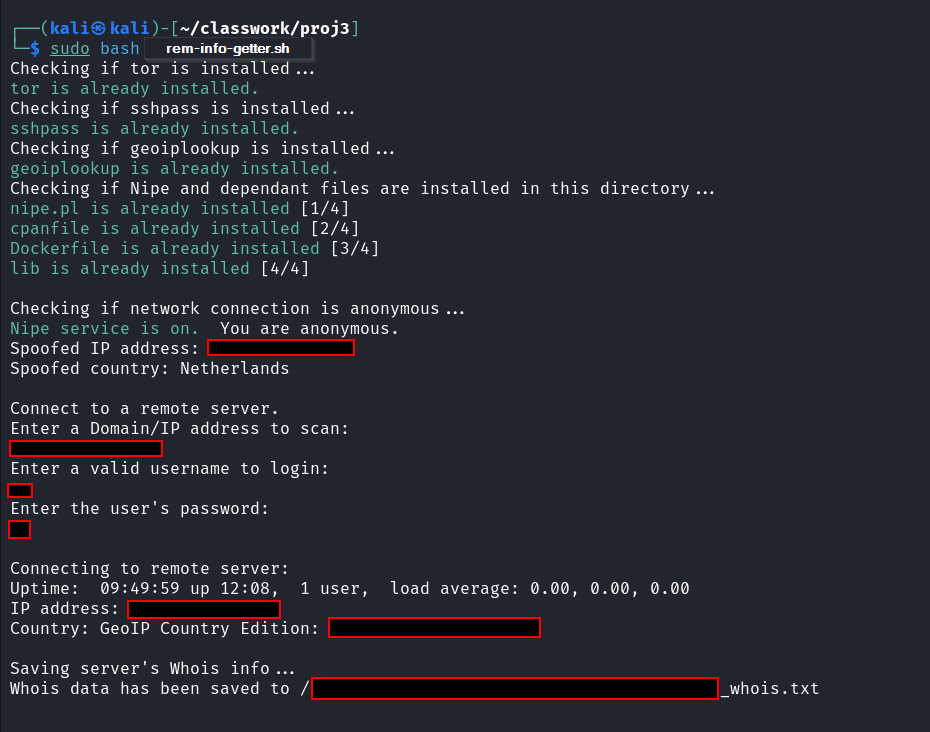
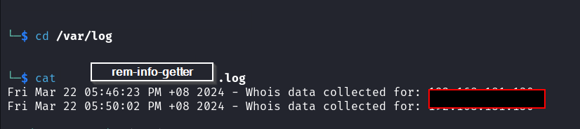

# RemoteInfoGetter  
A Bash CLI script for linux to automate using Nipe, connecting to a specified remote host, then getting info.  
Tested in Kali Linux.  

## How to Use  
To run this script, use command `sudo bash <nameofthisfile.sh>`  

## Contents  
Scope 1, Part 1 - Installations and Anonymity Check:  
[1] Check if needed applications are installed, if yes THEN go to next step. ELSE install.  
[2a] Check if network connection is anonymous (Nipe service on) If service disabled, turn on.  
[2b] If unable to connect to Nipe, alert user, and exit script.  
[2c] If sucessfully connected to Nipe, display the spoofed IP and Country.  
  
Scope 1, Part 2 - Scan the remote server:  
[2-1] User specify domain or IP address to scan  
[2-2] Connect to remote server using sshpass  
[2-3] Show remote server's info - uptime, ip address, country  
  
Scope 1, Part 3 - Whois info and log:  
[3-1] Save remote server's Whois data to file, in local machine.  
[3-2] Create a log file on local machine for this data collection. Include day, date, time, domain/ip that was scanned.  

## Sample Output  
  

## Sample Log Output  
  
  
